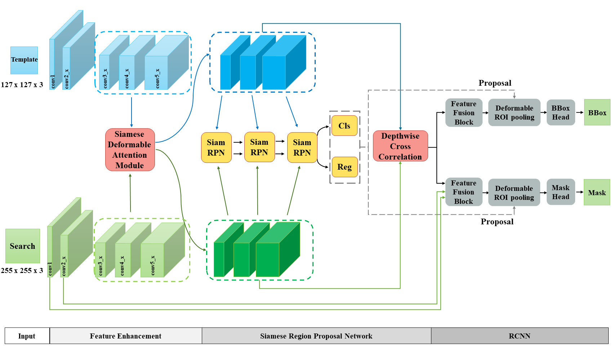

[](https://creativecommons.org/licenses/by-nc/4.0/)

# Deformable Siamese Attention Networks for Visual Object Tracking (SiamAttn)

This is the **PyTorch** implementation for the paper:

    Deformable Siamese Attention Networks for Visual Object Tracking;
    Yuechen Yu, Yilei Xiong, Weilin Huang, Matthew R. Scott
    In: Proceedings of the IEEE/CVF Conference on Computer Vision and Pattern Recognition (CVPR), 2020.

The full paper is available at: [CVF](https://openaccess.thecvf.com/content_CVPR_2020/html/Yu_Deformable_Siamese_Attention_Networks_for_Visual_Object_Tracking_CVPR_2020_paper.html) and [arXiv](https://arxiv.org/abs/2004.06711).

 

Our code is based on [PySOT](https://github.com/STVIR/pysot) repository. You may check the original [README.md](https://github.com/STVIR/pysot/blob/master/README.md) of PySOT. 

## Installation
Please refer to [INSTALL.md](INSTALL.md) for installation. 

## Inference

### Setup
Set enviroment variable `PYTHONPATH` as following. 
```bash
export PYTHONPATH=/path/to/siamattn:$PYTHONPATH
```

Download datasets and put them into `testing_dataset` directory. Jsons of commonly used datasets can be downloaded from [Google Drive](https://drive.google.com/drive/folders/10cfXjwQQBQeu48XMf2xc_W1LucpistPI) or [BaiduYun](https://pan.baidu.com/s/1js0Qhykqqur7_lNRtle1tA#list/path=%2F). If you want to test tracker on new dataset, please refer to [pysot-toolkit](https://github.com/StrangerZhang/pysot-toolkit). 

Our models are provided on [Google Drive](https://drive.google.com/drive/folders/1043coIpFniNeIMW8VH_wRax5PBMU4sTR). Download the models into the working directory `experiments/siamattn`. The file structure is supposed to be as following. 
```
experiments/siamattn/
├── checkpoint
│   ├── checkpoint_otb100.pth
│   └── checkpoint_vot2018.pth
└── config
    ├── config_otb100.yaml
    └── config_vot2018.yaml
```

Change the working directory by following command.
```bash
cd /path/to/repo/experiments/siamattn
```
We assume we are in this working directory for testing and evaluating trackers as described below. 

### Test tracker

Test the model with the corresponding config file.
```bash
python -u ../../tools/test.py                           \
        --snapshot checkpoint/checkpoint_vot2018.pth    \ # model path
        --dataset VOT2018                               \ # dataset name
        --config config/config_vot2018.yaml               # config file
```
Testing results will be saved in `results\$dataset\$checkout_name` directory.

**Note**: The results used in our paper can be downloaded from [Google Drive](https://drive.google.com/drive/folders/1043coIpFniNeIMW8VH_wRax5PBMU4sTR).

### Eval tracker
Eval the model based on the results of testing. 
```bash
python ../../tools/eval.py              \
        --tracker_path ./results        \ # result path
        --dataset VOT2018               \ # dataset name
        --num 1                         \ # number thread to eval
        --tracker_prefix 'checkpoint'     # tracker_name_prefix
```

## Citations
Please cite our paper if this implementation helps your research. BibTeX reference is shown in the following.
```
@inproceedings{yu2020deformable,
    title={Deformable Siamese Attention Networks for Visual Object Tracking},
    author={Yu, Yuechen and Xiong, Yilei and Huang, Weilin and Scott, Matthew R},
    booktitle={Proceedings of the IEEE/CVF Conference on Computer Vision and Pattern Recognition},
    pages={6728--6737},
    year={2020}
}
```

## Contact

For any questions, please feel free to reach: 
```
github@malongtech.com
```

## License

SiamAttn is CC-BY-NC 4.0 licensed, as found in the [LICENSE](LICENSE) file. It is released for academic research / non-commercial use only. If you wish to use for commercial purposes, please contact sales@malongtech.com.

